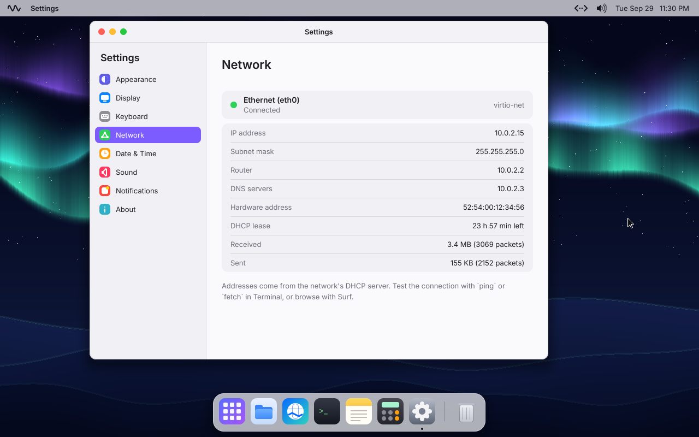
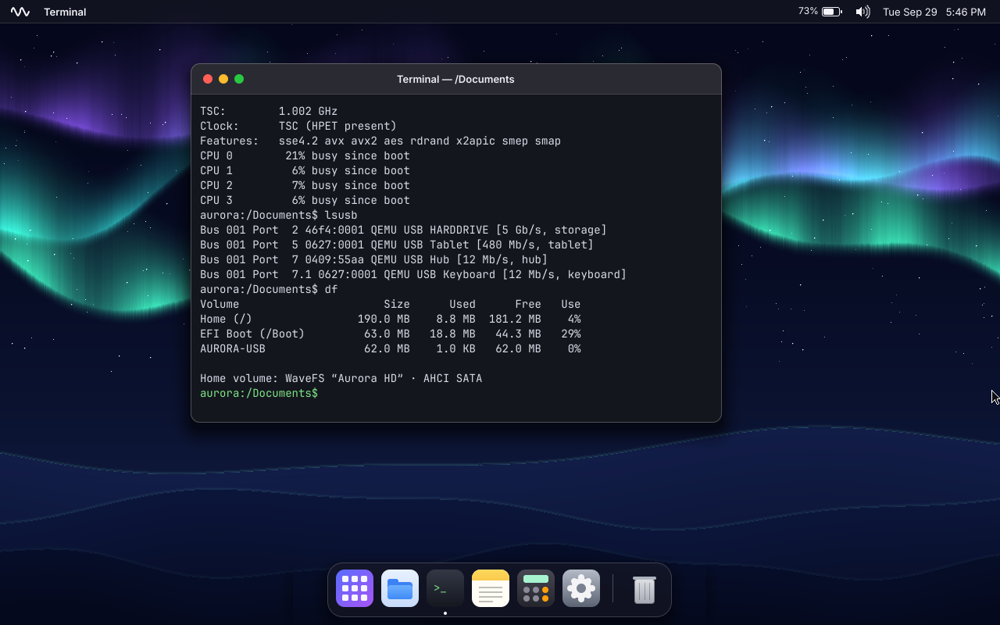

# WaveOS Aurora

**A 64-bit operating system built from scratch in Rust, aiming to feel as intuitive as macOS and Windows.**

Every layer is original: the UEFI bootloader, the **Aster** kernel, the storage, USB, sound and network drivers, the TCP/IP stack, the **AuroraFS** filesystem, the **Lumen Server** window server, the desktop shell, the apps, and a web browser, **Nebula**, with its own HTML, CSS, layout and TLS. There is no Linux, no BSD and no borrowed userland underneath.

The current development branch adds live Lumen backdrop glass, Desktop & Dock and Accessibility settings, AuroraKit declarative controls, `.gina` installation, and a native Constellation Studio foundation. **The native Rust compiler port and source debugger are not complete.** See [the implementation status and developer guide](docs/CONSTELLATION.md) for working features, commands, compatibility guarantees, and remaining acceptance work, and [the validation report](docs/VALIDATION-2026-09-30.md) for screenshots, actual tests and performance measurements.


| Nebula on Wikipedia | Nebula on Hacker News |
|---|---|
|  |  |
| **Network tools in Terminal** | **Settings → Network** |
|  |  |
| **Spotlight** | **Notification Center** |
|  |  |
| **Settings** | **Activity Monitor** |
|  |  |
| **A USB stick and the battery** | **Hardware reports in Terminal** |
|  |  |

## System Explorer

A live, interactive map of the whole OS: [`docs/explorer/`](docs/explorer/index.html).


```sh
cargo xtask run --monitor     # boots WaveOS and opens http://127.0.0.1:7777
```

While WaveOS runs, the explorer streams what the kernel is doing:
- **Boot progress**, stage by stage
- **The scheduler's decisions** as a timeline: a strip per CPU, and one lane per task
- **Per-task and per-process CPU time**, memory, system calls, interrupts, disk I/O and open windows

Every part of the architecture map glows with its real activity. Click a part to see what it does, its live numbers and the source files behind it. Opened on its own, the page replays a recorded session instead.

## What works today (Milestones 1–6)

- **Boots on UEFI x86_64** with its own bootloader (`firstlight`). It loads the kernel and a read-only system image.
- **Aster kernel** (hybrid design):
  - memory management, with per-process address spaces and no-execute pages
  - **multicore**: every CPU runs tasks, with per-CPU run queues, work stealing and TLB shootdowns
  - HPET and TSC clocks, APIC timers, MSI/MSI-X interrupts
  - `syscall`/`sysret`, with fault-safe copies of user memory
  - PS/2, VMware absolute pointer and USB input
  - **ACPI** through an AML interpreter: the power button, battery, power adapter and lid, shutdown and restart
  - **Sleep** (S3 suspend to RAM) and resume
- **Real user space.** Every app is its own **ring-3 process** with its own address space:
  - **Crash isolation:** an app that crashes gets a "quit unexpectedly" report, and everything else keeps running.
  - **System calls:** about 55 of them, covering processes, threads, files, pipes, windows, events, the clipboard, drag and drop, notifications, preferences, sound and power. Every pointer is validated.
  - **Libraries:** the `corekit` runtime, and the **AuroraKit** UI toolkit.
- **Lumen Server window server**, in the kernel like Windows NT's:
  - apps draw into shared-memory surfaces that Lumen Server composites
  - rendering is damage-tracked, with anti-aliased shapes, soft shadows and frosted glass
- **Aurora desktop:**
  - a menu bar, dock and searchable launcher
  - windows you can drag, resize, minimize and zoom
  - light and dark mode, broadcast live to every app
  - three procedurally generated wallpapers
- **Apps:** Nebula, Files, Terminal, Notes, Calculator, Settings, Preview, Paint, Clock, Activity Monitor, About, Welcome.
- **Networking**, all our own:
  - **drivers** for virtio-net and Intel e1000/e1000e, interrupt-driven where MSI allows
  - an **IPv4 stack** in the kernel: ARP, ICMP, UDP and **TCP** (retransmission timers, fast retransmit, congestion control, window scaling), a **DHCP** client, and BSD-like sockets for programs
  - **DNS**, and an **HTTP/1.1** client with keep-alive, chunked and gzip responses
  - **TLS 1.3** (and 1.2 for older servers) with our own handshake, record layer and X.509 certificate checks against Mozilla's root CAs. Cryptographic primitives come from RustCrypto.
  - a menu-bar status item, **Settings → Network**, and network graphs in Activity Monitor
- **Nebula**, the web browser, on our own engine:
  - an HTML parser, and CSS with selectors, the cascade, custom properties, `calc()`, media queries and generated content
  - layout: blocks, inline text with line breaking, lists, tables, flexbox and grid rows, floats, form controls
  - PNG, **JPEG** (baseline and progressive) and GIF images, from our own decoders
  - history, find in page (Ctrl+F), zoom, search forms and downloads (one window at a time; no tabs or JavaScript yet)
- **aurora-sh**, the Terminal shell. It runs about 35 programs from `/System/Bin` as separate processes (`ls`, `cat`, `grep`, `wc`, `ps`, `kill`, `cp`, `mv`, `neofetch`, `lspci`, `lsusb`, `cpuinfo`, `dmesg`, `battery`, `play`, `ping`, `ifconfig`, `nslookup`, `fetch`…). It supports pipelines (`ls -l | grep txt`), redirection (`>`, `>>`), lists (`a && b || c; d`), Ctrl+C and Tab completion.
- **Storage:**
  - PCI enumeration, plus interrupt-driven **AHCI** (SATA), **virtio-blk** and **NVMe** drivers
  - **USB sticks** appear in Files under Locations and can be ejected; booted from a USB stick, WaveOS keeps your files on it
  - your files live on **AuroraFS**, our own journaled filesystem, and survive reboots and power cuts
  - the EFI partition is readable and writable at `/Boot` (FAT32 with long file names)
  - `/System` is the read-only system image
- **Files**, a real file manager: icon and sortable list views, multiple selection with a rubber band, **drag and drop** (between windows, onto folders, onto the dock), search as you type, Quick Look (Space), picture thumbnails, and a **Trash** with Put Back.
- **Lyra, our TrueType engine,** draws text at any size, with kerning and exact anti-aliasing, even in the kernel.
- **Spotlight** (Super+Space or Ctrl+Space) finds apps, files, settings and system commands, and does quick calculations.
- **Notifications:** banners, and a Notification Center with a calendar and Do Not Disturb (click the clock).
- **Smooth windows:** open, close, minimize-to-dock and zoom animations.
- **Notes** is a proper editor: selection, the system clipboard, undo, find, fonts, Save As. **Preview** opens PNG, JPEG, GIF and BMP pictures (our own codecs), **Paint** draws and saves PNGs, **Clock** has world clocks, alarms, a stopwatch and timers, and **Activity Monitor** shows every process, CPU, memory and disk.
- **Settings:** appearance with accent colours and any picture as wallpaper, display resolution (live on QEMU), six keyboard layouts with dead keys, date and time, and more. Everything is remembered.
- **Threads** in user space, with futex-based locks, and SSE for apps.
- **USB:** an xHCI (USB 3) driver with hubs, keyboards, mice, tablets and storage, plugged in at any time.
- **Sound:** an Intel HD Audio driver and a mixer. System sounds, a menu-bar volume control, volume keys, headphone detection, and programs can play audio.
- **Laptop-ready:** a battery indicator with time remaining, low-battery warnings, the power button, and sleep from the menu, Spotlight or the lid.

## Quick start

You need an x86_64 or Apple Silicon Mac, or a Linux machine, with:

- [rustup](https://rustup.rs). The nightly selector installs automatically; `xtask` requires the exact Rust/LLVM baseline recorded in `tools/toolchain-baseline.toml`.
- QEMU, which bundles OVMF UEFI firmware:
  - macOS: `brew install qemu`
  - Debian/Ubuntu: `sudo apt install qemu-system-x86 ovmf`

```sh
git clone https://github.com/Sw3bbl3/waveos-aurora-rs.git
cd waveos-aurora-rs
cargo xtask run          # build everything and boot it in QEMU
```

The first build takes a minute or two. After that you boot straight to the desktop.

| Command | What it does |
|---|---|
| `cargo xtask build` | Builds the bootloader, kernel and user space into `target/esp/` |
| `cargo xtask run --monitor` | Same as `run`, plus the live System Explorer in your browser |
| `cargo xtask run` | Builds, then boots `target/waveos-aurora.img` in QEMU (4 CPUs, sound, USB, network). Your files on it persist across runs and rebuilds. Options: `--disk ahci\|virtio\|nvme` picks the controller, `--net virtio\|e1000\|e1000e\|none` the network card, `--smp N` the CPUs, `--battery` adds a laptop battery, `--usb-stick` plugs in a USB stick, `--fresh-disk` starts over, `--headless`, `--gdb`, `--int` |
| `cargo xtask test` | Runs the kernel self-tests headless, booting the same disk twice to check persistence. Add `--disk` to pick the controller, `--net` the network card, `--smp 1` for one CPU |
| `cargo xtask image` | Creates `target/waveos-aurora-usb.img` (ESP plus AuroraFS), ready to `dd` onto a USB stick |
| `cargo test -p aurorafs -p fat32 -p lumen -p aurora-image -p aurora-wav -p nebula-web -p nebula-secure -p nebula-engine -p xtask` | Host-side tests: filesystems (with crash recovery), the TrueType engine, the image and sound codecs, URLs and HTTP, TLS against rustls, the browser engine, and the test ACPI table |
| `cargo xtask iso` | Creates `target/waveos-aurora.iso` for a UEFI VM (requires xorriso; enable EFI) |


The kernel log streams to your terminal over the serial port. See [docs/BUILDING.md](docs/BUILDING.md) for debugging and troubleshooting, and [docs/HARDWARE.md](docs/HARDWARE.md) to try WaveOS on a real PC.

### Using the desktop

- **Launcher**: click the grid icon in the dock, or press and release the **Windows/Super** key. Start typing to search, and press Enter to open.
- **Spotlight**: **Super+Space** (or Ctrl+Space). Try an app name, a file name, `12*7+1`, `dark mode` or `keyboard`.
- **Notification Center**: click the clock in the menu bar.
- **Windows**:
  - drag the title bar to move a window
  - double-click the title bar to zoom
  - drag the bottom-right corner to resize
  - traffic-light buttons close, minimize and zoom
- **Shortcuts**:
  - `Alt+Tab` cycles windows
  - `Ctrl+W` or `Alt+F4` closes the front window
  - `Print Screen` or `Super+Shift+3` saves a screenshot to Pictures
  - in text: `Ctrl+A/C/X/V`, `Ctrl+Z` / `Ctrl+Shift+Z`, `Ctrl+F` to find, `Ctrl+S` to save
- **Aurora menu** (the wave at top-left): About, Settings, Sleep, Restart, Shut Down.
- **Menu bar**: click the network item for the connection, the speaker for the volume, the battery (on laptops) for its details, and the clock for the Notification Center. The volume keys work anywhere.
- **Nebula**: type an address or a search in the address bar (Ctrl+L). Alt+←/→ go back and forward, Ctrl+R reloads, Ctrl+F finds on the page, Ctrl +/−/0 zoom, Space and Page Up/Down scroll. `.html` files open in Nebula too.
- **Files**: drag items onto folders, the sidebar, another Files window, a dock app or the Trash (hold Ctrl to copy). Right-click for more; Space opens Quick Look, F2 renames, Delete moves to the Trash, Ctrl+1/2 switch views, Ctrl+F searches.
- **Terminal**: try `help`, `ps`, `df`, `neofetch`, `cpuinfo`, `lsusb`, `play --tone 440 500`, `ls -l | grep txt`, `echo hi > hi.txt`, `cat hi.txt | wc`, `ls /Boot`, `open notes`, `theme dark`, `ping example.com`, `ifconfig`, `fetch -i https://example.com`.

## How it fits together

```
 UEFI firmware
   └─ firstlight (bootloader/)     GOP mode, load kernel.elf, page tables, exit boot services
        └─ Aster kernel (kernel/)    higher half at 0xffffffff80000000
             ├─ arch/     GDT/TSS per CPU, IDT, APIC, MSI vectors, SMP start-up, context switch
             ├─ mm/       frames, heap, paging, TLB shootdowns
             ├─ sched/    per-CPU run queues, kernel threads and user threads
             ├─ acpi/     tables, AML runtime (power button, battery, lid), SCI
             ├─ power/    shutdown, restart, S3 sleep and resume
             ├─ drivers/  serial, PS/2 + keyboard layouts, vmmouse, RTC, HPET, PCI, display modes,
             │            block (AHCI, virtio-blk, NVMe, GPT, MBR), USB (xHCI, hubs, HID, storage), audio (HDA, mixer),
             │            network (virtio-net, e1000)
             ├─ net/      IPv4, ARP, ICMP, UDP, TCP, DHCP, sockets
             ├─ proc/     processes, pipes, reaper
             ├─ syscall/  system call dispatch
             ├─ fs/       VFS, block cache, AuroraFS (/), FAT32 (/Boot), TarFS (/System), RamFS
             └─ gui/      Lumen Server window server, desktop shell, clipboard, drag and drop, notifications, Spotlight
                  ↕ syscalls, shared-memory surfaces
 User space (userland/)     corekit runtime · AuroraKit toolkit · apps · /System/Bin tools
   libs/web · libs/tls · libs/surf   HTTP, TLS 1.3/1.2 and the Nebula engine (no_std, tested on the host)
```

The full tour, covering the boot handoff, memory layout, processes and syscalls, storage and AuroraFS's on-disk format, and rendering, is in [docs/ARCHITECTURE.md](docs/ARCHITECTURE.md).

## Roadmap

| Milestone | Focus |
|---|---|
| **M1** ✅ | Boot to a graphical desktop |
| **M2** ✅ | User space: ring 3, syscalls, ELF loader, pipes, shared-memory windows, and the "AuroraKit" UI toolkit |
| **M3** ✅ | Storage: AHCI, virtio-blk, NVMe, a VFS, FAT32, and our own journaled **AuroraFS** |
| **M4** ✅ | Apps and polish: TrueType text, Preview, Paint, Clock, Activity Monitor, drag and drop, Spotlight, notifications, animations, Settings |
| **M5** ✅ | Real hardware: SMP, HPET and TSC, MSI, USB (xHCI, HID, storage), HD Audio, ACPI (AML), sleep and resume |
| **M6** ✅ | Networking: virtio-net and e1000, TCP/IP, DHCP, DNS, HTTP, TLS, and the Nebula web browser |
| M7 | Next: tickless idle, per-CPU NVMe queues, a GPU driver, I²C touchpads, IPv6, more of the web platform |

Details are in [docs/ROADMAP.md](docs/ROADMAP.md).

## License

- **Code**: [MIT](LICENSE).
- **Fonts**: Inter and JetBrains Mono, both under the SIL Open Font License. See `assets/fonts/`.
- **Sample pictures** in `assets/home/Pictures` are generated by `tools/make_sample_pictures.py`.
