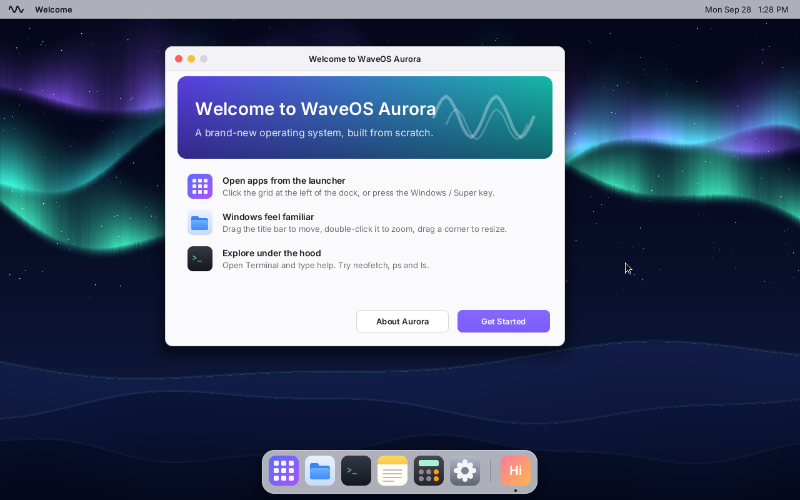
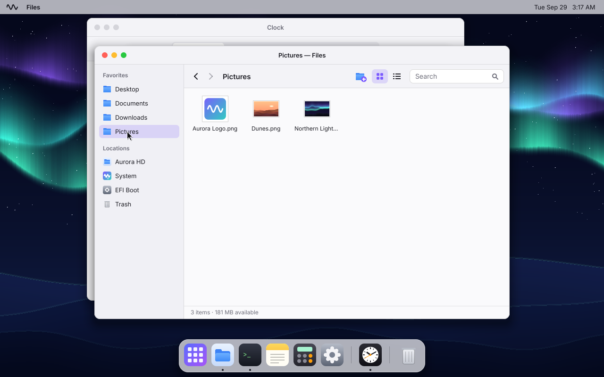
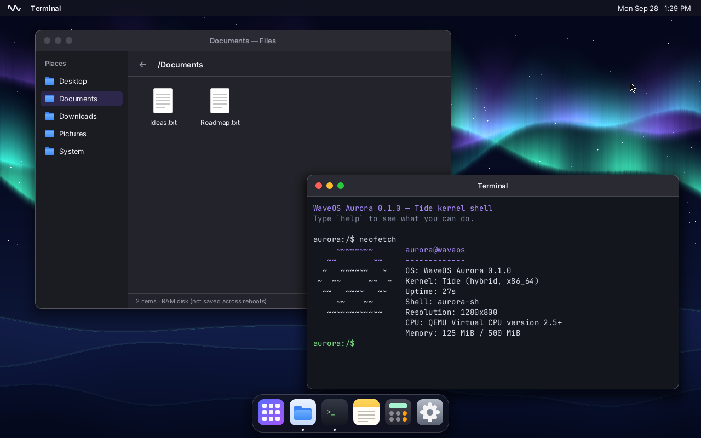

# WaveOS Aurora

**A 64-bit operating system built from scratch in Rust, aiming to feel as intuitive as macOS and Windows.**

Every layer is original: the UEFI bootloader, the **Tide** kernel, the storage drivers, the **WaveFS** filesystem, the **Crest** window server, the desktop shell and the apps. There is no Linux, no BSD and no borrowed userland underneath.



| Files | Dark mode, Terminal and processes |
|---|---|
|  |  |

## System Explorer

A live, interactive map of the whole OS: [`docs/explorer/`](docs/explorer/index.html).


```sh
cargo xtask run --monitor     # boots WaveOS and opens http://127.0.0.1:7777
```

While WaveOS runs, the explorer streams what the kernel is doing:
- **Boot progress**, stage by stage
- **The scheduler's decisions** as a CPU timeline, one lane per task
- **Per-task and per-process CPU time**, memory, system calls, interrupts, disk I/O and open windows

Every part of the architecture map glows with its real activity. Click a part to see what it does, its live numbers and the source files behind it. Opened on its own, the page replays a recorded session instead.

## What works today (Milestones 1–3)

- **Boots on UEFI x86_64** with its own bootloader (`aurora-boot`). It loads the kernel and a read-only system image.
- **Tide kernel** (hybrid design):
  - memory management, with per-process address spaces and no-execute pages
  - ACPI, APIC timer and interrupts
  - a preemptive scheduler
  - `syscall`/`sysret`
  - PS/2 and VMware absolute pointer input
  - ACPI shutdown and restart
- **Real user space.** Every app is its own **ring-3 process** with its own address space:
  - **Crash isolation:** an app that crashes gets a "quit unexpectedly" report, and everything else keeps running.
  - **System calls:** about 37 of them, covering processes, files, pipes, windows and events. Every pointer is validated.
  - **Libraries:** the `libaurora` runtime, and the **Ripple** UI toolkit.
- **Crest window server**, in the kernel like Windows NT's:
  - apps draw into shared-memory surfaces that Crest composites
  - rendering is damage-tracked, with anti-aliased shapes, soft shadows and frosted glass
- **Aurora desktop:**
  - a menu bar, dock and searchable launcher
  - windows you can drag, resize, minimize and zoom
  - light and dark mode, broadcast live to every app
  - three procedurally generated wallpapers
- **Apps:** Files, Terminal, Notes, Calculator, Settings, About, Welcome.
- **aurora-sh**, the Terminal shell. It runs about 20 programs from `/System/Bin` as separate processes (`ls`, `cat`, `grep`, `wc`, `ps`, `kill`, `cp`, `mv`, `neofetch`…). It supports pipelines (`ls -l | grep txt`), redirection (`>`, `>>`), Ctrl+C and Tab completion.
- **Storage:**
  - PCI enumeration, plus **AHCI** (SATA), **virtio-blk** and **NVMe** drivers
  - your files live on **WaveFS**, our own journaled filesystem, and survive reboots and power cuts
  - the EFI partition is readable and writable at `/Boot` (FAT32 with long file names)
  - `/System` is the read-only system image
- **Files**, a real file manager. It shows your volumes and supports New Folder, inline Rename, Delete with confirmation, Copy/Cut/Paste and right-click menus.
- **Settings are remembered.** The theme and wallpaper are saved to `/Settings/aurora.conf`.

## Quick start

You need an x86_64 or Apple Silicon Mac, or a Linux machine, with:

- [rustup](https://rustup.rs). The pinned nightly toolchain installs automatically.
- QEMU, which bundles OVMF UEFI firmware:
  - macOS: `brew install qemu`
  - Debian/Ubuntu: `sudo apt install qemu-system-x86 ovmf`

```sh
git clone https://github.com/Sw3bbl3/waveos-aurora-rs.git
cd waveos-aurora-rs
cargo xtask run          # build everything and boot it in QEMU
```

The first build takes a minute or two. After that you boot straight to the desktop.

| Command | What it does |
|---|---|
| `cargo xtask build` | Builds the bootloader, kernel and user space into `target/esp/` |
| `cargo xtask run --monitor` | Same as `run`, plus the live System Explorer in your browser |
| `cargo xtask run` | Builds, then boots `target/waveos-aurora.img` in QEMU. Your files on it persist across runs and rebuilds. Options: `--disk ahci\|virtio\|nvme` picks the controller, `--fresh-disk` starts over, `--headless`, `--gdb`, `--int` |
| `cargo xtask test` | Runs the kernel self-tests headless, booting the same disk twice to check persistence. Add `--disk` to pick the controller |
| `cargo xtask image` | Creates `target/waveos-aurora-usb.img` (ESP plus WaveFS), ready to `dd` onto a USB stick |
| `cargo test -p wavefs -p fat32` | Host-side filesystem tests, including crash recovery |

The kernel log streams to your terminal over the serial port. See [docs/BUILDING.md](docs/BUILDING.md) for real hardware, debugging and troubleshooting.

### Using the desktop

- **Launcher**: click the grid icon in the dock, or press the **Windows/Super** key. Start typing to search, and press Enter to open.
- **Windows**:
  - drag the title bar to move a window
  - double-click the title bar to zoom
  - drag the bottom-right corner to resize
  - traffic-light buttons close, minimize and zoom
- **Shortcuts**:
  - `Alt+Tab` cycles windows
  - `Ctrl+W` or `Alt+F4` closes the front window
  - `Ctrl+S` saves in Notes
- **Aurora menu** (the wave at top-left): About, Settings, Restart, Shut Down.
- **Files**: right-click for Open / Rename / Copy / Cut / Delete, or New Folder on empty space. Shortcuts: F2 renames, Delete deletes, and Ctrl+C / X / V copy, cut and paste.
- **Terminal**: try `help`, `ps`, `df`, `neofetch`, `ls -l | grep txt`, `echo hi > hi.txt`, `cat hi.txt | wc`, `ls /Boot`, `open notes`, `theme dark`.

## How it fits together

```
 UEFI firmware
   └─ aurora-boot (bootloader/)     GOP mode, load kernel.elf, page tables, exit boot services
        └─ Tide kernel (kernel/)    higher half at 0xffffffff80000000
             ├─ arch/     GDT, IDT, APIC, context switch
             ├─ mm/       frames, heap, paging
             ├─ sched/    preemptive kernel threads
             ├─ drivers/  serial, PS/2, vmmouse, RTC, PCI, block (AHCI, virtio-blk, NVMe, GPT)
             ├─ proc/     processes, pipes, reaper
             ├─ syscall/  system call dispatch
             ├─ fs/       VFS, block cache, WaveFS (/), FAT32 (/Boot), TarFS (/System), RamFS
             └─ gui/      Crest window server, desktop shell
                  ↕ syscalls, shared-memory surfaces
 User space (userland/)     libaurora runtime · Ripple toolkit · apps · /System/Bin tools
```

The full tour, covering the boot handoff, memory layout, processes and syscalls, storage and WaveFS's on-disk format, and rendering, is in [docs/ARCHITECTURE.md](docs/ARCHITECTURE.md).

## Roadmap

| Milestone | Focus |
|---|---|
| **M1** ✅ | Boot to a graphical desktop |
| **M2** ✅ | User space: ring 3, syscalls, ELF loader, pipes, shared-memory windows, and the "Ripple" UI toolkit |
| **M3** ✅ | Storage: AHCI, virtio-blk, NVMe, a VFS, FAT32, and our own journaled **WaveFS** |
| M4 | More apps: a richer editor, an image viewer, more Settings |
| M5 | Real hardware: SMP, HPET, USB (xHCI), power management |
| M6 | Networking: virtio-net and e1000, TCP/IP, DHCP, DNS, HTTP |

Details are in [docs/ROADMAP.md](docs/ROADMAP.md).

## License

- **Code**: [MIT](LICENSE).
- **Fonts**: Inter and JetBrains Mono, both under the SIL Open Font License. See `assets/fonts/`.
