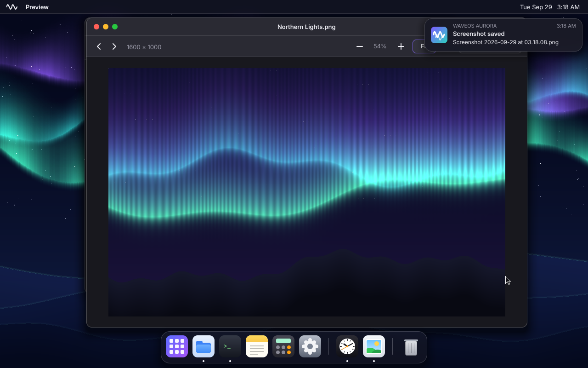
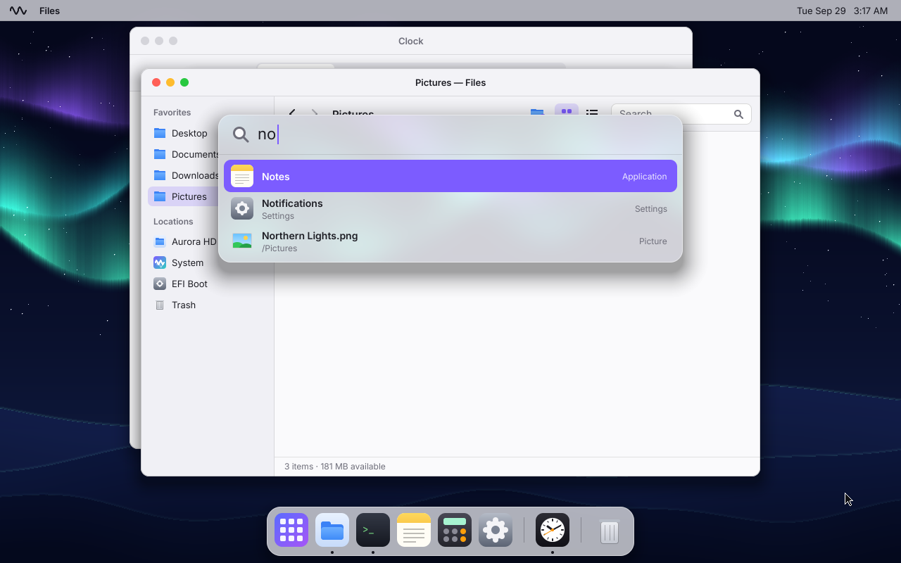
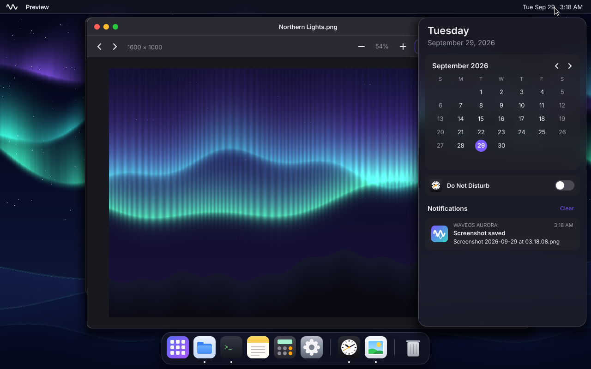
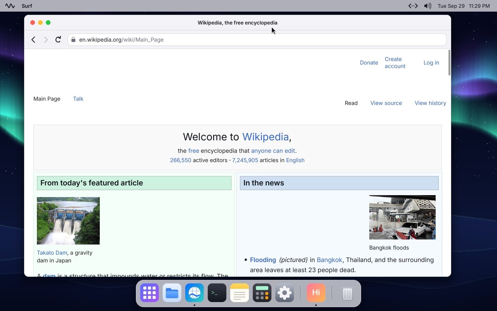
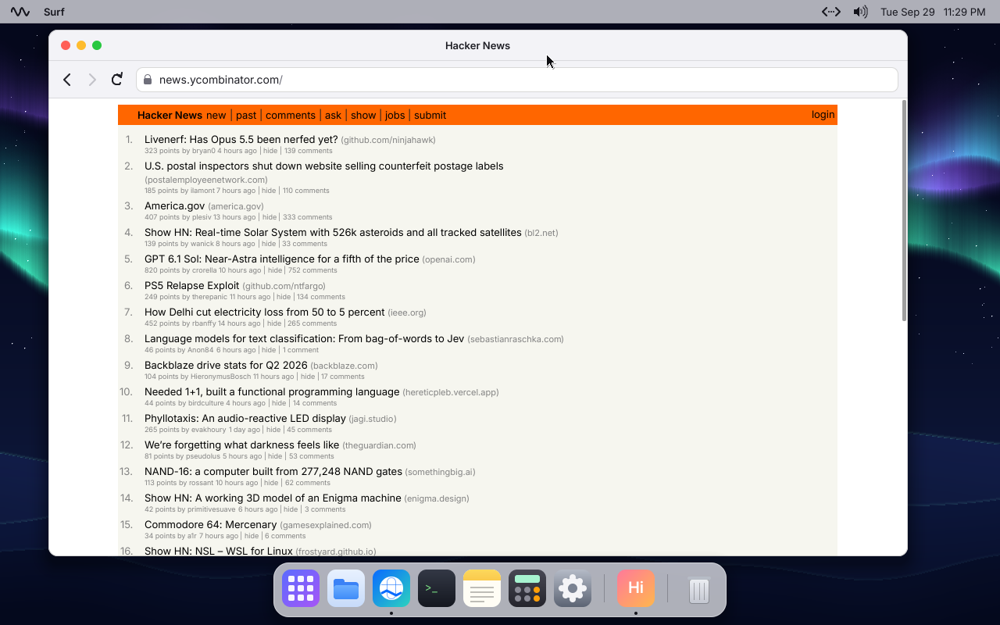
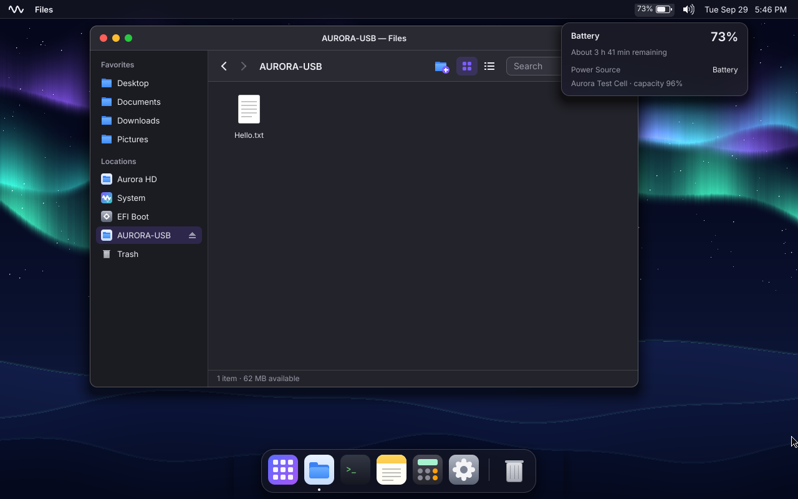
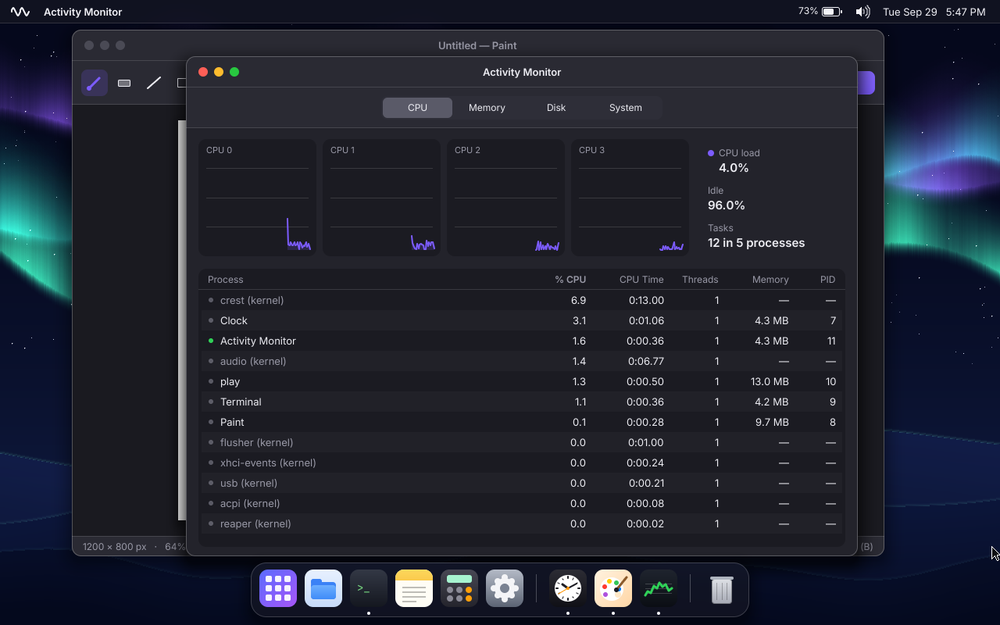
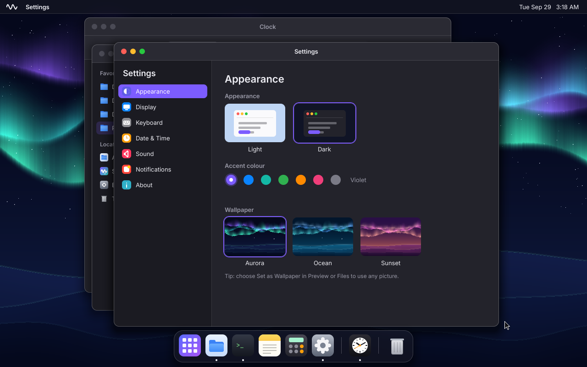
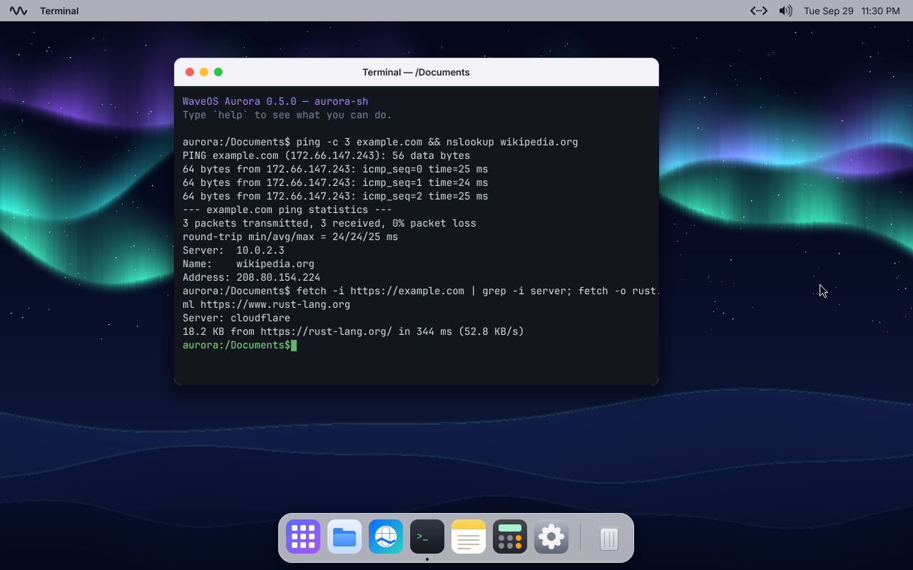
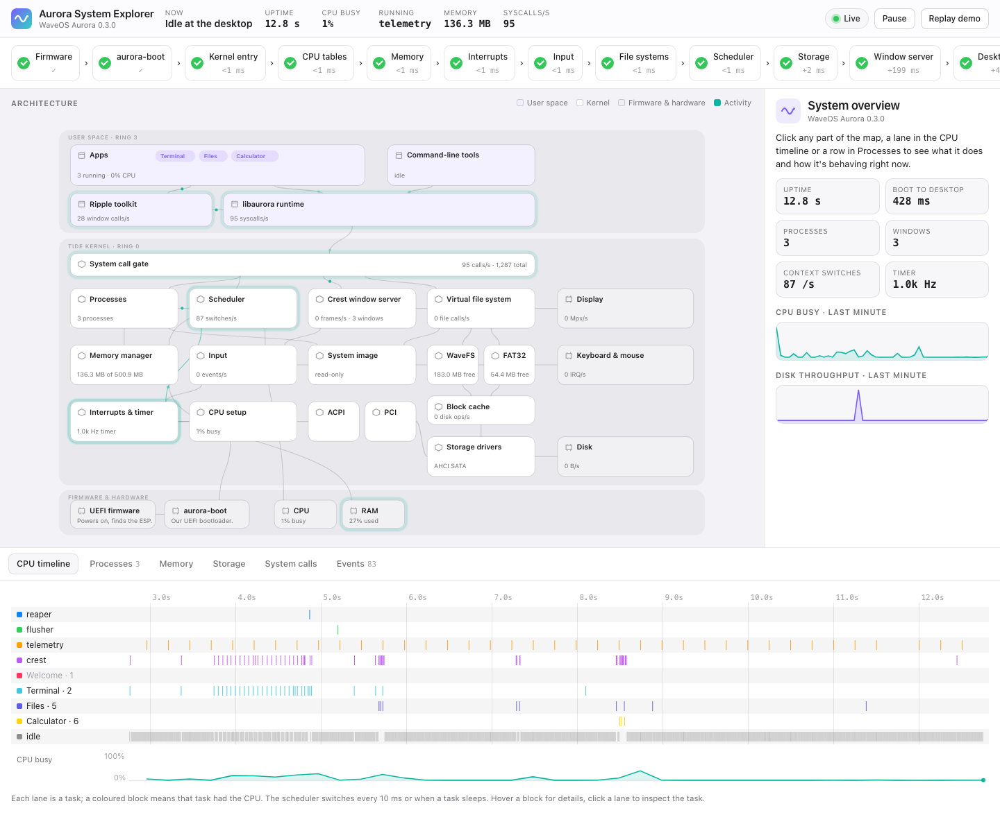

<div align="center">

# WaveOS Aurora

### An entire operating system. Written from scratch. In Rust.

The bootloader, kernel, drivers, filesystem, window server, network stack, web browser, and every app — designed together, built together, from the first instruction to the last pixel.



[Get started](#get-started) · [Explore the system](docs/explorer/index.html) · [Read the handbook](docs/handbook/0.7/en/start-welcome.md) · [Every feature](docs/FEATURES.md)

</div>

---

## Beautiful by default.

A menu bar, a dock and windows that glide. Frosted glass that really blurs what's behind it. Light and dark mode that every app follows the instant you switch. Text drawn by **Lyra**, our own TrueType engine, crisp at every size.

| | |
|---|---|
|  |  |
| **Spotlight.** Apps, files, settings and quick maths, one keystroke away. | **Notification Center.** Banners, a calendar and Do Not Disturb, a click on the clock. |

## The web, on an engine of our own.

**Nebula** loads real websites through a stack we wrote ourselves: the network drivers, TCP/IP, TLS 1.3, HTTP, and an HTML and CSS engine with flexbox, grid and tables. And now **Pulsar**, our new JavaScript engine, is on its way in.

| | |
|---|---|
|  |  |

## Every app in its own world.

Each app runs as a separate, protected process. If one crashes, you see a polite "quit unexpectedly" — and everything else keeps right on working. Your files live on **AuroraFS**, a journaled filesystem built to survive a power cut.

| | |
|---|---|
|  |  |
| **Files.** Drag and drop, Quick Look, thumbnails, a Trash with Put Back, and USB sticks that just appear. | **Activity Monitor.** Every process, every core, every byte — live. |

## Made for real machines.

Multicore scheduling. USB 3. NVMe and SATA. Sound with headphone detection. Battery, lid and sleep. Wired networking that's ready the moment you boot.

| | |
|---|---|
|  |  |
| **Settings.** Accent colours, wallpapers, resolution, keyboards and more — all remembered. | **Terminal.** A real shell, with pipes, redirection and 35 programs. |

## See inside, while it runs.

The **System Explorer** is a live map of the whole OS. Watch it boot, see each CPU's scheduling decisions, and click any part to see what it's doing and the source code behind it.



---

## Get started

You need a Mac (Apple silicon or Intel) or a Linux PC, [rustup](https://rustup.rs) and QEMU (`brew install qemu`, or `sudo apt install qemu-system-x86 ovmf`).

```sh
git clone https://github.com/Sw3bbl3/waveos-aurora-rs.git
cd waveos-aurora-rs
cargo xtask run
```

A minute later, you're at the desktop. Add `--monitor` to open the System Explorer alongside it. To try a real PC, see [HARDWARE.md](docs/HARDWARE.md); for every build command, see [FEATURES.md](docs/FEATURES.md#build-commands).

## Under the hood

| | |
|---|---|
| **Firstlight** | UEFI bootloader |
| **Aster** | Hybrid kernel: multicore, ACPI, sleep and resume |
| **AuroraFS** | Journaled, extent-based filesystem |
| **Lumen Server** | Compositing window server |
| **AuroraKit** | The UI toolkit every app is built with |
| **Lyra** | TrueType font engine |
| **Nebula** | Web browser: HTTP, TLS, HTML, CSS and layout |
| **Pulsar** | JavaScript engine — [in development](docs/PULSAR.md) |

Nearly everything is our own. Where we stand on others' shoulders, we say so: cryptographic primitives come from [RustCrypto](https://github.com/RustCrypto), ACPI's AML interpreter from the [`acpi`](https://crates.io/crates/acpi) crate, and maths functions from [`libm`](https://crates.io/crates/libm).

Go deeper: [Architecture](docs/ARCHITECTURE.md) · [Every feature](docs/FEATURES.md) · [Roadmap](docs/ROADMAP.md) · [Building and debugging](docs/BUILDING.md) · [Validation](docs/VALIDATION-2026-09-30.md) · [Contributing](CONTRIBUTING.md)

## License

Code under the [MIT License](LICENSE). Inter and JetBrains Mono under the SIL Open Font License.
