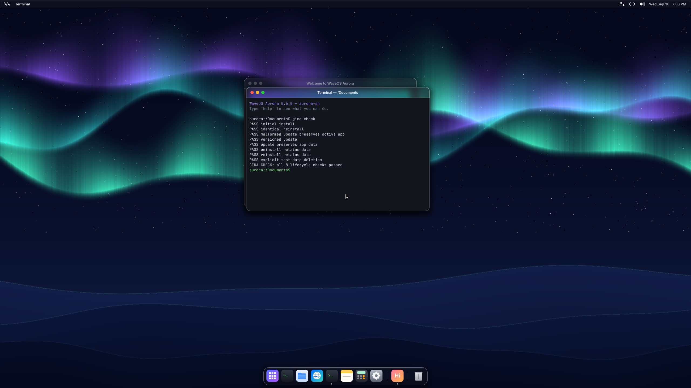
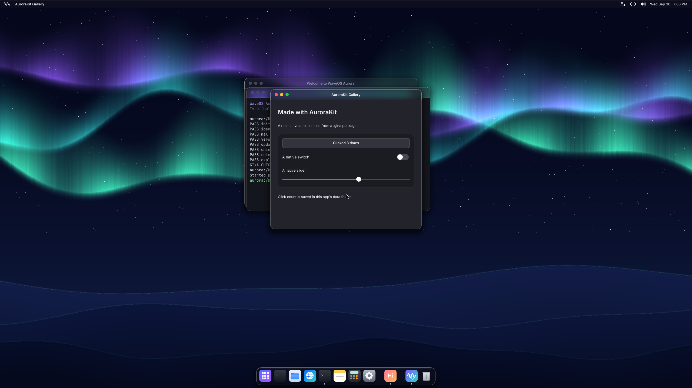
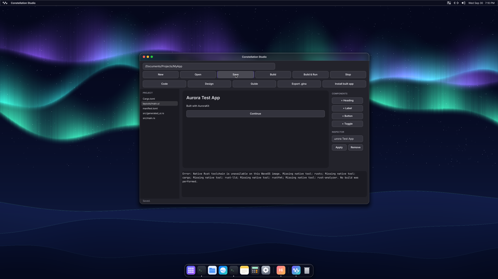
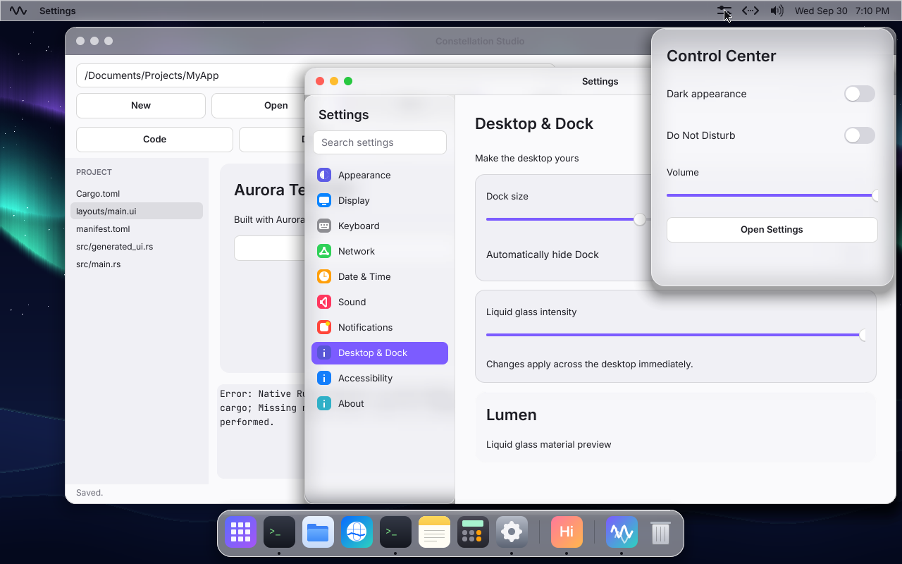
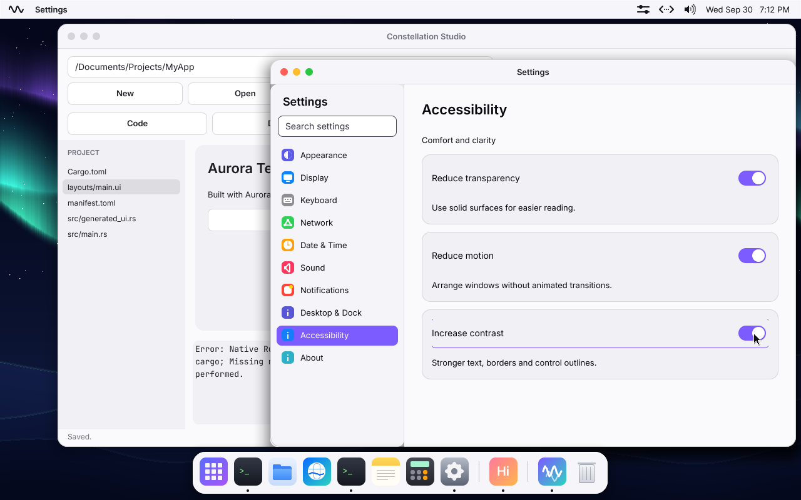
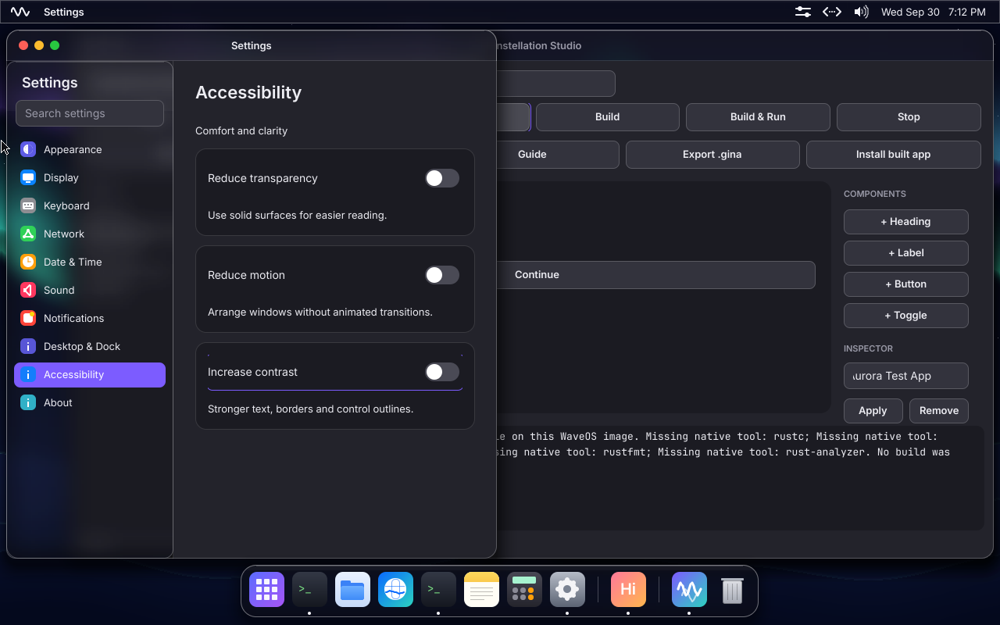

# Aurora / Constellation validation — 2026-09-30

This records executed checks, not completion of the full product plan. The compiler port and native source debugger remain unimplemented, so the final offline Studio build/debug acceptance **does not pass**.

## Build and regression checks

| Check | Observed result |
|---|---|
| `cargo xtask build` | Pass, including Aster, FirstLight and the complete native application workspace |
| `cargo test -p lumen -p gina -p xtask -p aurorafs` | 24 tests passed |
| `cargo xtask test` | 31 kernel tests passed on each of two boots; persistence verified; recorded audio peak 4319 |
| `git diff --check` | Pass |
| Original `kernel/src/tests.rs` changes | All four pre-existing network diagnostic log lines retained |
| Existing desktop disk | Booted and updated in place; original settings/user data retained; APFS-clone backup at `target/waveos-before-constellation.img` |

Logs: `target/final-unit-tests.log`, `target/final-kernel-tests.log`, `target/optimized-build.log`. The system archive is about 11 MiB. This is not a measurement of native toolchain size; no native toolchain is bundled.

## On-device GINA checks

With QEMU networking disabled (`--net none`), the native `gina-check` program exercised:

1. Initial validated installation.
2. Identical package reinstallation.
3. Rejection of a malformed update, keeping the active app unchanged.
4. Selection of a new versioned payload.
5. App-data retention through update.
6. Uninstall while retaining app data.
7. Reinstall while retaining app data.
8. Explicit deletion of the test app and its test data.

All eight passed. The test uses a unique app ID and leaves the user's gallery/data alone. Separately, the gallery was installed, launched as a real process, interacted with, then reopened after restarting QEMU. Its counter remained **3**.

Opening the `.gina` through the desktop file-opening path presented update details in GINA Apps. Clicking Update completed successfully; Open App launched the updated generation with the same saved counter.

The gallery executable is host-precompiled when assembling the image. These results verify installation and execution, not native Rust compilation. Host-side GINA tests also exercise traversal, duplicate/unsupported metadata, links, checksums, resources and ABI rejection. Power-cut injection during installation, full-disk update rollback, and malicious compositor-region syscall tests remain to be added.

## Desktop and Studio checks

- Inspected light and dark appearances at 2560×1440 and 1280×800.
- Changed resolution live and accepted the confirmation dialog.
- Exercised live Reduce Transparency, Reduce Motion and Increase Contrast; restored them afterward.
- Inspected real background content blurring behind the Settings sidebar and Control Center.
- Dragged Settings to the left edge, inspected the snap preview, and confirmed the snapped layout.
- Created `/Documents/Projects/MyApp` in Studio, opened the generated Rust source, switched to Design, changed the heading through the property inspector to “Aurora Test App”, and saved.
- Pressed Build & Run and observed the explicit missing-native-toolchain error. No replacement executable was installed.

These are sampled interaction checks, not exhaustive validation of every layout, focus path, resize edge or material clipping case. The Settings search currently returns matching pages; fully indexed individual-setting navigation remains incomplete.

## Host keyboard capture

The first interactive Cocoa launch reported `Could not create event tap, system key combos will not be captured`. After the user enabled QEMU Accessibility and QEMU restarted, that warning disappeared. The configured display backend is `cocoa,full-grab=on,left-command-key=on,swap-opt-cmd=off`; release is Control+Option+G.

The native computer-control interface could not select Homebrew's standalone QEMU executable. A physical-keyboard confirmation of Command+Space, Command+Tab and release was requested but has not been received. QMP checks do not establish host interception.

## Rendering measurements

Measured using QEMU 11.1.1 on the Apple Silicon host, x86_64 guest, four virtual CPUs and 512 MiB RAM. Lumen's counters time scene composition plus framebuffer flush; they exclude client-side drawing and are not end-to-end input-latency measurements.

| Final image sample | Frames | Mean | Maximum |
|---|---:|---:|---:|
| Cocoa, 1280×800, initial desktop | 8 | 32 ms | 39 ms |
| Cocoa, 1280×800, opening Settings | 14 | 42 ms | 71 ms |
| Cocoa, 2560×1440, Settings and resolution confirmation | 10 | 61 ms | 84 ms |
| Headless, 1280×800, Studio and Settings open | 11 | 51 ms | 72 ms |

Logs: `target/aurora-final-session.log` and `target/material-performance.log`. These are small interaction samples with different scene contents, not controlled before/after benchmarks. They do **not** establish 60 fps. Scene reconstruction, software shadows, and backdrop dependency tracking still need optimization. Improvements in this branch include reusable blur buffers, cached finished materials, coarser moving-window samples, cursor-only scene reuse, and elimination of the Settings idle repaint loop.

## Outstanding final acceptance

Native Rust/Cargo/LLVM execution, a complete offline sysroot/dependency bundle, build scripts/procedural macros, rust-analyzer/rustfmt, kernel process-debug controls, source breakpoints/stepping/variable inspection, and Studio debugger integration remain outstanding. The complete offline create → design → build → install → run → debug → export → reboot sequence has not been achieved.
