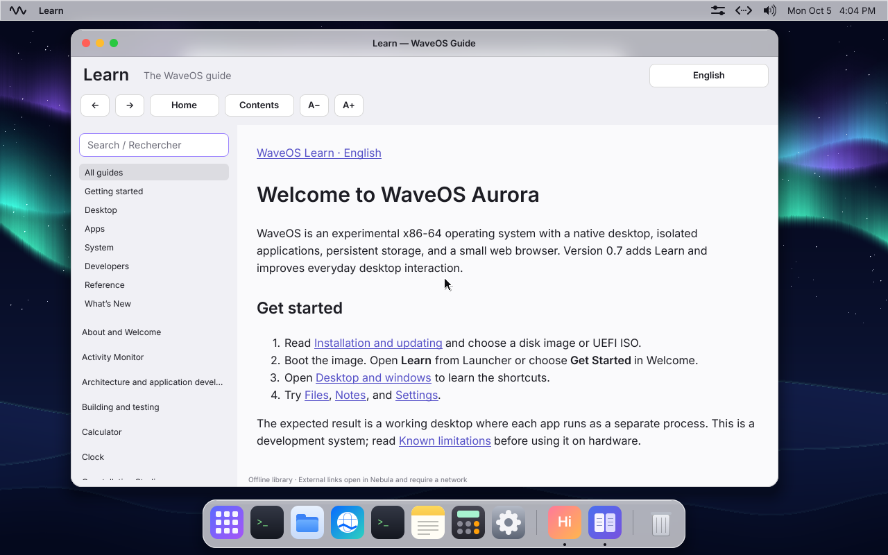

# Learn
Browse every guide without a network connection.

## Use the app
1. Open Learn from Launcher or the Aurora menu.
2. Choose a category or press Ctrl+F and enter a search phrase. Title matches appear first.
3. Select an article, follow its contents links, and use Back/Forward to retrace your reading.
4. Use the language selector for Français (Canada) or English. Use A−/A+ to change reading size.

## Expected result and troubleshooting
Language and reading size persist. External links are marked as requiring the network and open in Nebula. There are no guided lessons or progress checklists in this version.

See [Desktop and windows](desktop-windows.md) for shared shortcuts and [Recovery](reference-recovery.md) if the app cannot open.

## Release screenshot

