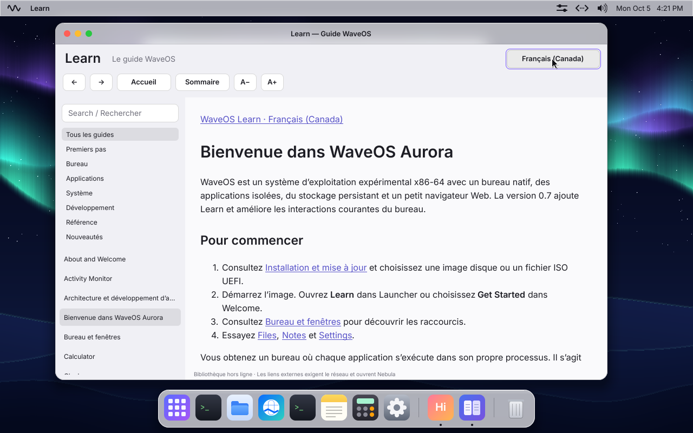

# Learn
Consultez tous les guides sans connexion réseau.

## Utiliser l’application
1. Ouvrez Learn dans Launcher ou dans le menu Aurora.
2. Choisissez une catégorie ou appuyez sur Ctrl+F et saisissez des mots. Les titres correspondants apparaissent en premier.
3. Choisissez un article, suivez les liens du sommaire et utilisez Back/Forward pour retrouver vos lectures.
4. Choisissez Français (Canada) ou English. Utilisez A−/A+ pour ajuster la taille du texte.

## Résultat attendu et dépannage
La langue et la taille du texte sont conservées. Les liens externes indiquent qu’une connexion est requise et s’ouvrent dans Nebula. Cette version ne comprend pas de leçons guidées ni de listes de progression.

Voir [Bureau et fenêtres](desktop-windows.md) pour les raccourcis communs et [Récupération](reference-recovery.md) si l’application ne s’ouvre pas.

## Capture de la version

